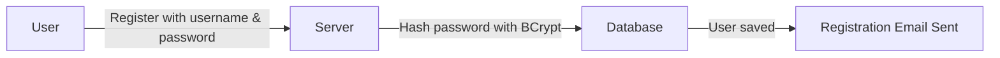
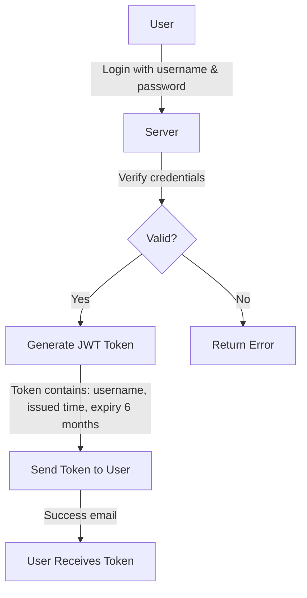
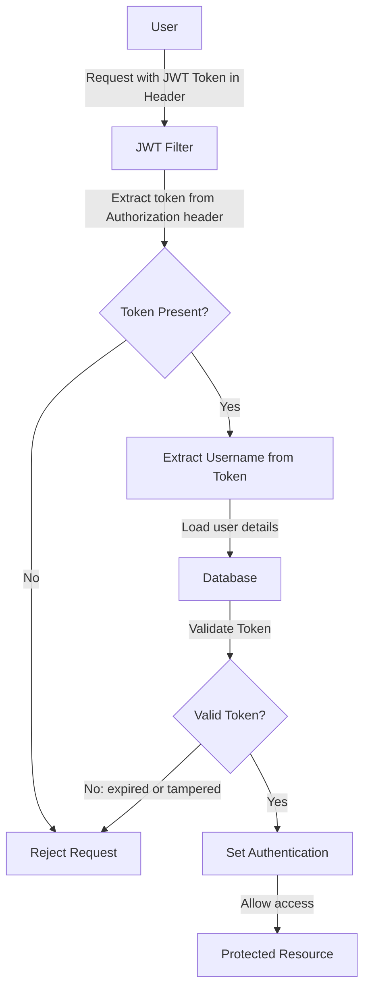
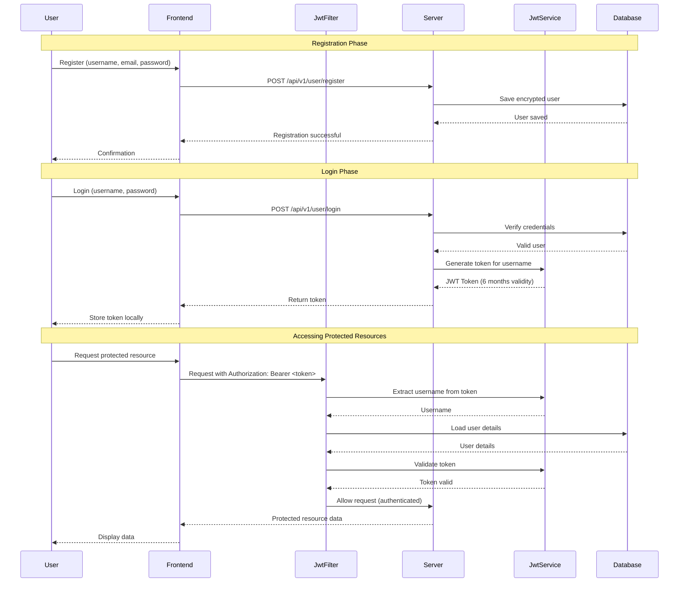
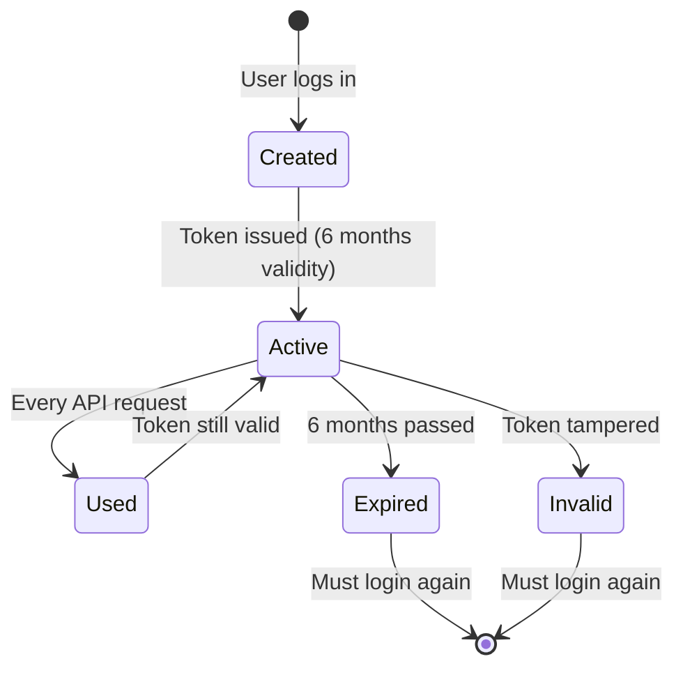

# JWT Authentication in Chaloo Project

## What is JWT?

**JWT (JSON Web Token)** is a secure way to verify who you are when using a web application. Think of it like a special ID card that proves your identity without requiring you to show your password every time.

## Why Use JWT?

In traditional authentication, the server keeps track of every logged-in user (called "sessions"). This can be heavy for the server. JWT is different:

- **Stateless**: The server doesn't need to remember who's logged in
- **Secure**: The token is digitally signed and can't be tampered with
- **Efficient**: Once you log in, you carry your "ID card" (token) for future requests
- **Scalable**: Perfect for modern web apps and mobile applications

## How JWT Works in This Project

### 🔑 The Secret Key

When the application starts, it generates a **secret key** using a secure algorithm (HmacSHA256). This secret key is like a stamp that only the server knows how to create and verify.

---

## 📋 JWT Workflow

### **Step 1: User Registration**

**What happens:**
1. User provides username, email, and password
2. Server encrypts the password using BCrypt (a one-way encryption)
3. User details are saved in the database
4. A confirmation email is sent

---

### **Step 2: User Login & Token Generation**

**What happens:**
1. User sends login credentials (username and password)
2. Server verifies the password against the encrypted version in database
3. If valid, server creates a JWT token containing:
   - **Username** (who you are)
   - **Issued Time** (when the token was created)
   - **Expiry Time** (token valid for 6 months)
4. Server signs the token with the secret key
5. Token is sent back to the user
6. A login confirmation email is sent

> **Token Example Structure:**
> - **Header**: Algorithm and token type
> - **Payload**: User information (username, expiry)
> - **Signature**: Digital signature created with secret key

---

### **Step 3: Accessing Protected Resources**

**What happens:**
1. User makes a request to access protected resources
2. User includes the JWT token in the request header: `Authorization: Bearer <token>`
3. **JWT Filter** intercepts every request and checks:
   - Is there an Authorization header?
   - Does it start with "Bearer "?
   - Extract the token from the header
4. **Token Validation**:
   - Extract the username from the token
   - Load the user details from the database
   - Check if the token signature is valid (not tampered)
   - Check if the token is not expired (6-month validity)
5. If everything is valid:
   - User is authenticated for this request
   - Request proceeds to the protected resource
6. If invalid:
   - Request is rejected

---

## 🔐 Security Features

### **1. Token Signing**
Every JWT token is signed with the secret key. If someone tries to modify the token (like changing the username), the signature won't match, and the server will reject it.

### **2. Password Encryption**
User passwords are never stored in plain text. They are encrypted using BCrypt with a strength of 12, making them virtually impossible to reverse-engineer.

### **3. Token Expiration**
Tokens automatically expire after 6 months. This prevents old, potentially compromised tokens from being used indefinitely.

### **4. Automatic Validation**
The JWT Filter automatically checks every request, ensuring no unauthorized access to protected resources.

---

## 🔄 Complete Authentication Flow

---

## ⚙️ Key Components

### **1. JwtService**
- **Generates JWT tokens** when user logs in
- **Validates tokens** by checking signature and expiry
- **Extracts information** from tokens (like username)

### **2. JwtFilter**
- **Intercepts every HTTP request**
- **Checks for JWT token** in the Authorization header
- **Validates the token** before allowing access
- **Sets up authentication** for the current request

### **3. Security Configuration**
- **Configures which endpoints** need authentication
- **Integrates JWT Filter** into the security chain
- **Manages password encryption**

---

## 📱 How It Works from User Perspective

### When You Sign Up:
1. Enter your details
2. Your password is encrypted and saved
3. You receive a confirmation email

### When You Login:
1. Enter username and password
2. If correct, you receive a special token
3. Your app saves this token
4. You receive a login confirmation email

### When You Use the App:
1. Every request includes your token
2. Server checks if your token is valid
3. If valid, you can access features
4. If expired or invalid, you need to login again

### When Token Expires (After 6 Months):
1. Server rejects your token
2. You need to login again
3. You get a fresh token for another 6 months

---

## 🎯 Benefits of This JWT Implementation

1. **No Session Storage**: Server doesn't need to remember logged-in users
2. **Scalable**: Easy to add more servers without sharing session data
3. **Mobile-Friendly**: Perfect for mobile apps and web apps
4. **Secure**: Tokens are signed and can't be tampered with
5. **Long-Lasting**: 6-month validity means users don't need to login frequently
6. **Automatic**: JWT Filter handles all authentication automatically

---

## 🔒 Token Lifecycle

---

## Summary

JWT authentication in the Chaloo project provides a secure, efficient, and scalable way to manage user authentication. Users login once and receive a token that serves as their digital identity for 6 months. Every request is automatically validated by the JWT Filter, ensuring only authenticated users can access protected resources. The implementation uses industry-standard security practices including BCrypt for password encryption and HMAC-SHA256 for token signing.
